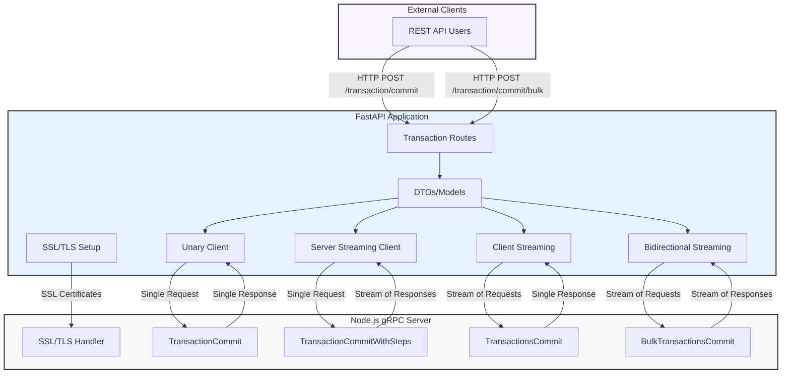

# gRPC Communication Example
A demonstration of gRPC communication patterns between Python client and Node.js server with SSL/TLS security.


## Architecture Diagram



## Overview
This project demonstrates different gRPC communication patterns:

- Unary RPC (single request/response)

- Server Streaming (one request, multiple responses)

- Client Streaming (multiple requests, one response)

- Bidirectional Streaming (multiple requests and responses)


## Project Structure
- [server/](server/) - Node.js gRPC server (TypeScript)

- [client/](client/) - Fast API gRPC client (Python)

- [proto/](proto/) - Protobuf definitions

- [docs/](docs/) - Documentation

- [tests/](tests/) - Tests


## Prerequisites

Node.js (v14+), Python (v3.8+), UV package manager, `Make`

## Getting Started

### Server Setup (TypeScript)

```bash
# Install dependencies
npm i

# Generate TypeScript proto files
npm run generate:proto:ts

# Start the server
npm run start:server

# Run server tests
npm run test:server
```

### Client Setup (Python)
```bash
# Create and activate virtual environment
python -m venv .venv
source .venv/bin/activate

# Install dependencies
uv pip install .

# Generate Python proto files
make generate

# Start the client
make start
# or
npm run start:client

# Run client tests
make test-unit
```


## Security
The communication is secured using SSL/TLS certificates. See [Faced Problems](./docs/faced_problems.md) for details about certificate generation and configuration.

## Additional Documentation
- [UV Tool Usage](./docs/uv.md) Guide for using the UV package manager

- [Troubleshooting](./docs/faced_problems.md) - Common issues and solutions

- [Additional Diagrams](./docs/another_diagram.md) - Another wat to render gRPC client<->server communication

- [VSCode configs](./.vscode/launch.json) - Some debug configurations for VSCode I used for debugging