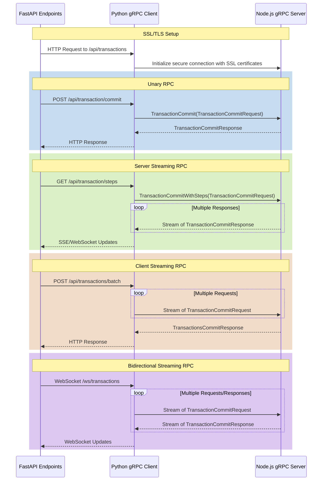

# gRPC Communication Patterns

This diagram illustrates the interaction patterns between our gRPC client and server.

```mermaid
sequenceDiagram
    participant API as FastAPI Endpoints
    participant Client as Python gRPC Client
    participant Server as Node.js gRPC Server

    Note over API,Server: SSL/TLS Setup
    API->>Client: HTTP Request to /api/transactions
    Client->>Server: Initialize secure connection with SSL certificates

    rect rgb(200, 220, 240)
        Note over API,Server: Unary RPC
        API->>Client: POST /api/transaction/commit
        Client->>Server: TransactionCommit(TransactionCommitRequest)
        Server-->>Client: TransactionCommitResponse
        Client-->>API: HTTP Response
    end

    rect rgb(220, 240, 200)
        Note over API,Server: Server Streaming RPC
        API->>Client: GET /api/transaction/steps
        Client->>Server: TransactionCommitWithSteps(TransactionCommitRequest)
        loop Multiple Responses
            Server-->>Client: Stream of TransactionCommitResponse
        end
        Client-->>API: SSE/WebSocket Updates
    end

    rect rgb(240, 220, 200)
        Note over API,Server: Client Streaming RPC
        API->>Client: POST /api/transactions/batch
        loop Multiple Requests
            Client->>Server: Stream of TransactionCommitRequest
        end
        Server-->>Client: TransactionsCommitResponse
        Client-->>API: HTTP Response
    end

    rect rgb(220, 200, 240)
        Note over API,Server: Bidirectional Streaming RPC
        API->>Client: WebSocket /ws/transactions
        loop Multiple Requests/Responses
            Client->>Server: Stream of TransactionCommitRequest
            Server-->>Client: Stream of TransactionCommitResponse
        end
        Client-->>API: WebSocket Updates
    end
```